# Demonstration

## Ading shapes

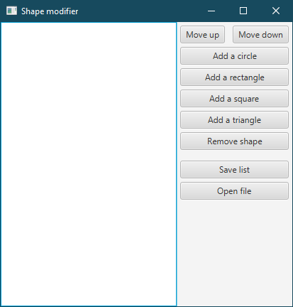

Now let's try to add a circle and test invalid values:

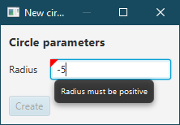
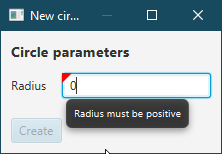
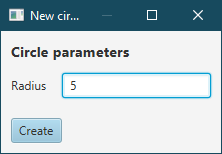

It's time for a rectangle:

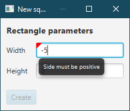
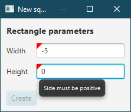
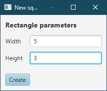

Now we'll add a square:

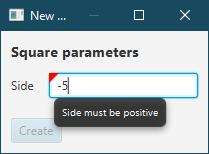
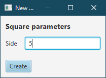

Finally, triangle:

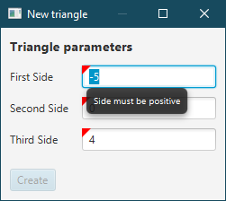
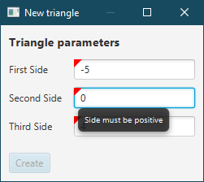
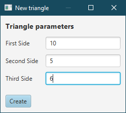

Let's check if the program handles impossible triangles:

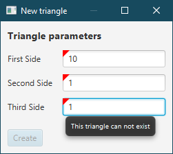

Also, behind the scenes, the circle with radius 0.5 was added. In result, we've got this list:

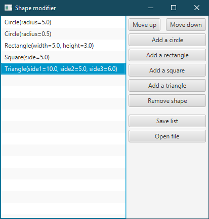

## Modifying the list

Let's try to move a couple of shapes. We'll move the triangle up:

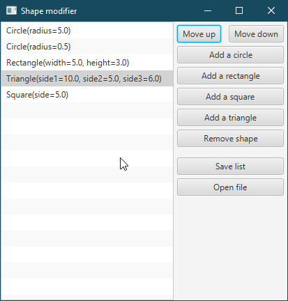

And let's move the new circle down:

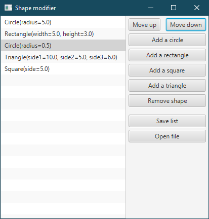

Now we'll check the remove button. For this, we'll remove the circle with radius equals to 0.5:

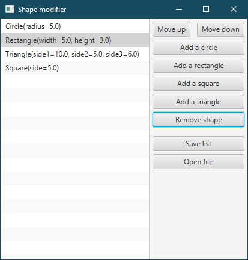

## Open/Save test

Now let's try to save this list to a **.json** file. After clicking on the save button, the system dialog window pops up:

The saved file is [here](shapesSaved.json)
We want to modify this list to show that open button is working, so let's add a square with each side equals to 55:

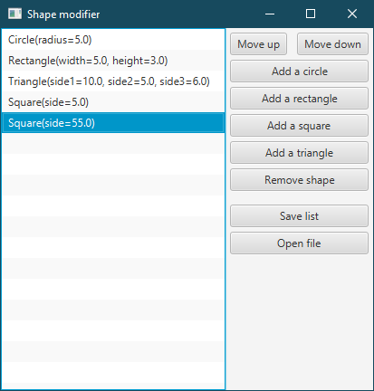

And right after this we'll click "Open". The system dialog pops up again:

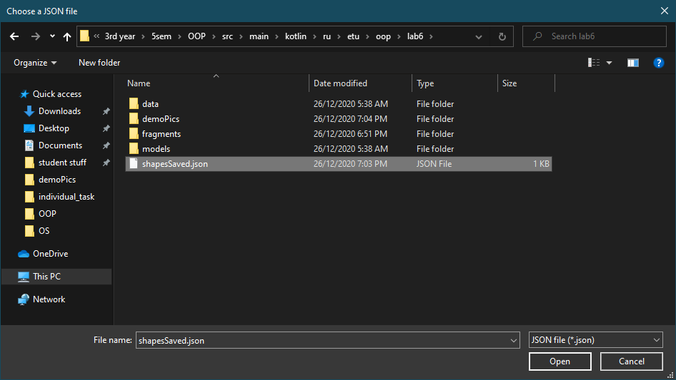

And we've got the list that we've saved:

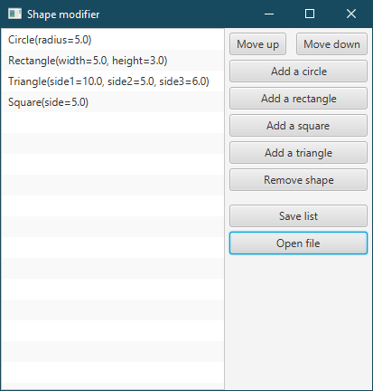

And now it is time to close our program. Task required to give a possibility to save before closing. So we'll modify our list again:

And let's click on the close button. System dialog pops up giving an opportunity to save list:

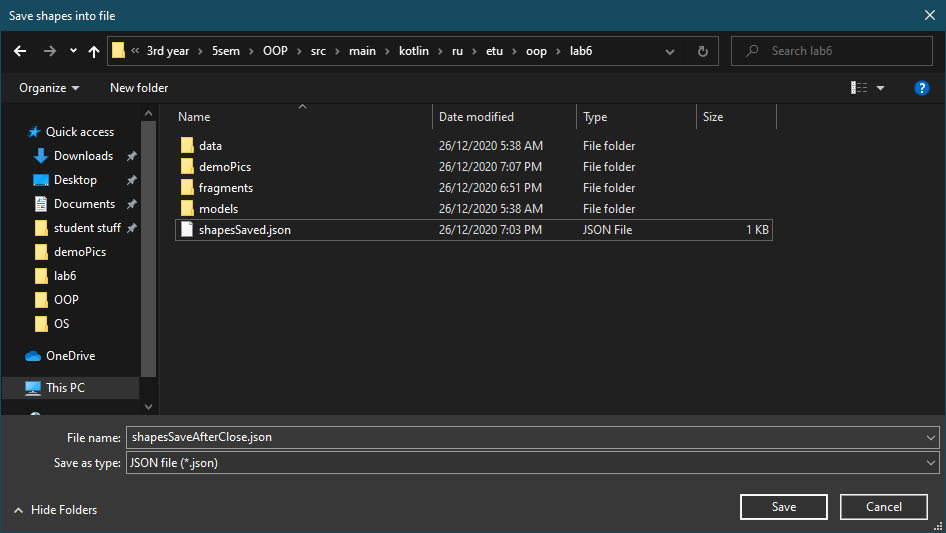

The saved file is [here](shapesSaveAfterClose.json)
